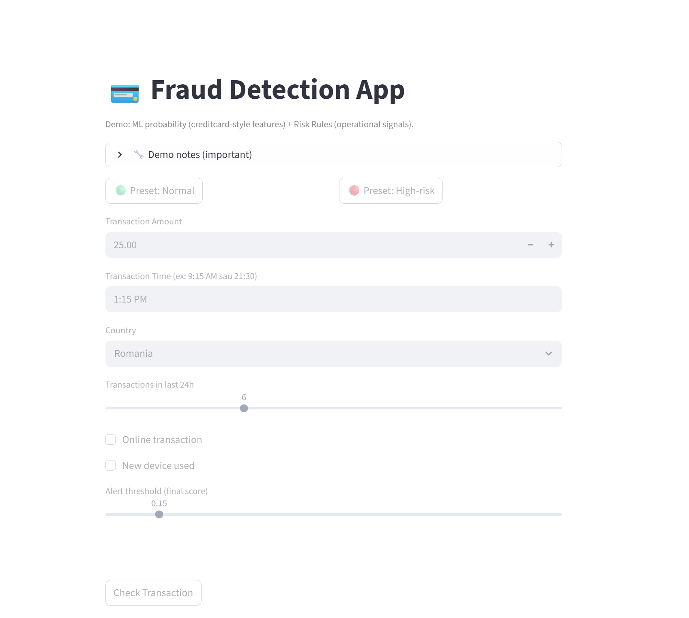

# 💳 Fraud Detection App

Demo application that simulates credit card fraud detection using a machine learning model and additional behavioral risk rules.

## Features

* Machine learning fraud probability prediction
* Risk signals (online transaction, new device, transaction frequency)
* Adjustable fraud alert threshold
* Interactive web interface

## Live Demo

Test the application here:
https://smart-fraud-detector.streamlit.app

## Demo Interface

## 📊 Dataset

- Source: Kaggle — Credit Card Fraud Detection
- 284,807 transactions, 492 fraudulent (0.17% fraud rate)
- Highly imbalanced dataset — evaluated primarily on Recall and PR-AUC

## 🤖 Model Results

| Model | Accuracy | Precision | Recall | F1-Score | ROC-AUC | PR-AUC |
|---|---|---|---|---|---|---|
| **Random Forest** | 99.94% | 82.47% | 81.63% | 82.05% | 96.28% | **85.55%** |
| Logistic Regression | 97.55% | 6.10% | 91.84% | 11.44% | 97.21% | 71.90% |
| Decision Tree | 98.06% | 6.93% | 82.65% | 12.79% | 90.75% | 47.50% |

> Selected model: **Random Forest** — best balance between Precision and Recall, with a PR-AUC of 85.55% on a heavily imbalanced dataset.

## ⚙️ How It Works

**1. Machine Learning Model**

Random Forest trained on anonymized features from real credit card transactions.

**2. Behavioral Risk Rules**

Additional fraud signals:
- Transactions after 10 PM
- Online payments
- New device used
- High transaction frequency in the last 24 hours
- Transaction from a foreign country

Both signals are combined into a **final fraud score**.

## 🛠️ Tech Stack

- Python · Streamlit · Scikit-learn · Pandas

## ▶️ Run Locally

pip install -r requirements.txt
streamlit run app/app.py

## 📁 Project Structure

fraud-detection-app/
├── app/          # Streamlit application
├── assets/       # Screenshots
├── model/        # Saved models + comparison results
├── src/          # Model comparison script
├── requirements.txt
└── README.md
